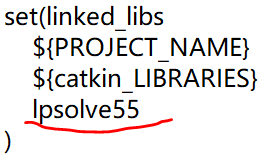

# How to link dynamic libraries, use third-party libraries in ROS, lpsolve solver as examples

## Usage

    catkin_make
    roscore
    rosrun 
    rosrun test_ipsolve test_ipsolve_node 

or 
    
    rosrun test_ipsolve test_ipsolve_binary_node

the first node is to compute the linear programming problem, and the second node is to compute the mixed integer programming problem.

## Explanation
### 1.在ROS里如何链接动态库、使用第三方库、IPsolve库为例
### How to link dynamic libraries, use third-party libraries in ROS, lpsolve libraries as examples

1）先安装/下载第三方库文件，解压：
[lpsolve库](https://sourceforge.net/projects/lpsolve/)  
找到linux上用的： 
`Released /lpsolve/5.5.2.5/lp_solve_5.5.2.5_dev_ux64.tar.gz`  
（2）放入包下的include文件夹里  
（3）编写测试程序 
需要#include 该库的最核心头文件 
如： 

    #include "ipsolve/lp_lib.h"

（4）修改cmakelist文件 
①加入include目录 

    include_directories(
        include
        ${catkin_INCLUDE_DIRS}
    )
②链接动态库目录 

    link_directories(
        include/ipsolve
    ${catkin_LIB_DIRS}
    )
③链接动态库 

    set(linked_libs
        ${PROJECT_NAME}
        ${catkin_LIBRARIES}
        lpsolve55
    )

    target_link_libraries(test_ipsolve_node ${linked_libs} )

【注意！】 
①不需要写出库文件的后缀`.so` ②不需要写出库文件前面的lib单词。 
即对比：文件夹下面的库文件和写上的库文件名称： 
文件夹下面的库文件:  
 
写上的库文件名称： 
 

（5）编译，运行节点 
结果显示为： 
线性规划问题： 
  
整数线性规划问题： 

## 关于该案例的具体介绍
这个案例是参考某个人的博客，但是现在找不到链接了。当时不是写在ROS节点里的，就是简单的Ｃ++案例。还望知道的告知。
### 线性规划问题
在 `src/test.cpp` 里， 
目标函数：  
求解`max(4*x1 + 2*x2 + x3)`

    set_maxim(lp);//求解最大
    row[1] = 4;
    row[2] = 2;
    row[3] = 1;
    set_obj_fn(lp, row); /* construct the obj: 4 x1 + 2 x2 + x3 */

约束条件： 
subject to:  
`2*x1 + x2 < 1`  
`x1 + 2*x3 < 2`  
`x1 + x2 + x3 = 1`  

    row[1] = 2;
    row[2] = 1;
    row[3] = 0;
    add_constraint(lp, row, LE, 1);//约束1
    row[1] = 1;
    row[2] = 0;
    row[3] = 2;
    add_constraint(lp, row, LE, 2);//约束2
    row[1] = 1;
    row[2] = 1;
    row[3] = 1;
    add_constraint(lp, row, EQ, 1);//约束3

变量上下界： 

   
    set_bounds(lp, 1, 0.0, 1.0);//设置上下限
    set_bounds(lp, 2, 0.0, 1.0);//默认下限是0，其实可以用set_upbo
    set_bounds(lp, 3, 0.0, 2.0);

求解： 

      solve(lp);//求解

### 整数线性规划问题

和线性规划问题唯一不同的是，设置整数变量： 
    
      set_binary(lp, 1, TRUE);

求解的具体结果可以看上面的图片。